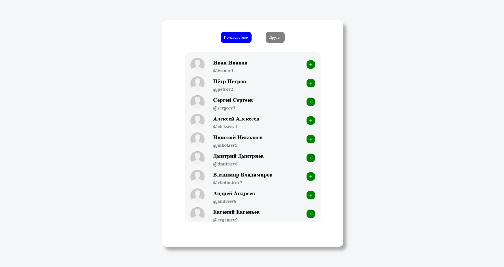
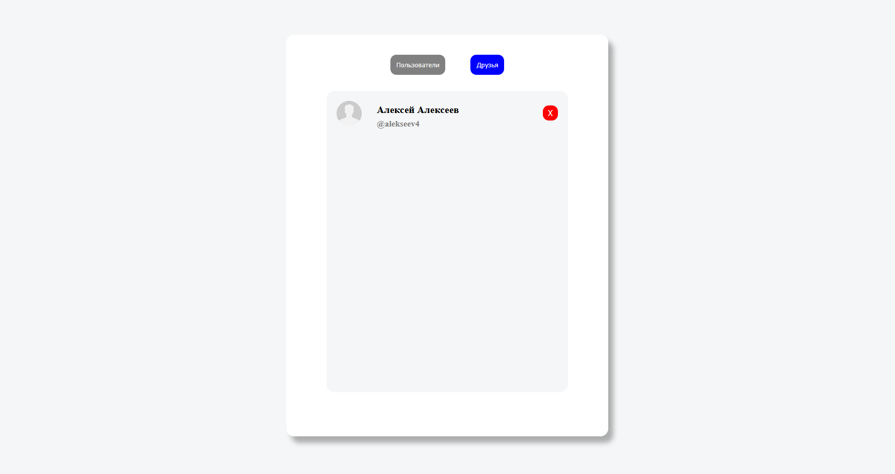

# 🎨 Список пользователей

Веб-приложение на Vue + TypeScript + Pinia, предназначенное для работы со списком пользователей. Приложение позволяет просматривать всех доступных пользователей, добавить в друзья и отслеживать кто из пользователей является другом. 

---

## 🚀 Используемый стек

  

 
 

---
